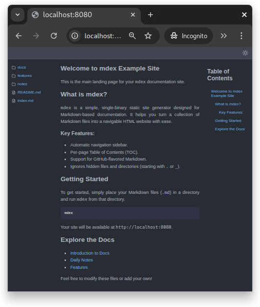
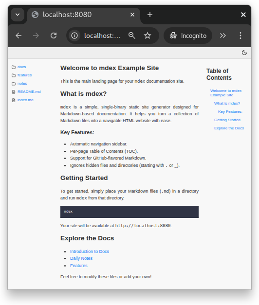

# 📚 mdex - markdown documentation site generator

`mdex` is a super simple static site generator that converts a directory of
Markdown (`.md`) files into a fully navigable HTML documentation site. Just
point it to a folder containing your Markdown files, and you're up and running!

## 🚀 Features

- 🛠 **Markdown to HTML Conversion** using
  [Goldmark](https://github.com/yuin/goldmark), with support for headings,
  tables, and GitHub-flavored Markdown.

- 🗂 **Automatic File Tree Navigation** rendered as a sidebar, showing the
  structure of the current directory with clickable links.

- 📑 **Per-Page Table of Contents (TOC)** generated from Markdown headings,
  allowing users to navigate sections within a page.

- 📦 **Single Binary Deployment** with no external dependencies, making it easy
  to deploy and run anywhere.

- 🚫 **Ignored Files and Directories**: Automatically skips files and
  directories starting with `.` (e.g., `.git`, `.DS_Store`) or `_` (e.g.,
  `_drafts`, `_includes`) during content generation and serving.

## 📸 Demo

### Screenshot

| Dark Mode                         | Light Mode                        |
| --------------------------------- | --------------------------------- |
|  |  |

## 📦 Installation

### Binary installation

[Download](https://github.com/jpbruinsslot/mdex/releases) a compatible binary
for your system. For convenience, place `mdex` in a directory where you can
access it from the command line.

### Via Go

```console
$ go install github.com/jpbruinsslot/mdex/cmd/mdex@latest
```

## 💻 Usage

To use `mdex`, you need to have a directory containing your Markdown files. The
default behavior is to generate a static site from the Markdown files in the
current directory and serve it on `http://localhost:8080`.

Go to the directory containing your Markdown files and run:

```console
$ mdex
```

Now you can access your site at `http://localhost:8080`.

### Try it Locally!

Want to see `mdex` in action right away?

1. You can clone the repository and run the example provided:

   ```bash
   git clone git@github.com:jpbruinsslot/mdex.git
   ```

2. **Navigate to the example directory** in your terminal:

   ```bash
   cd example
   ```

3. **Run `mdex`**:

   ```bash
   mdex
   ```

4. **Open your browser** to `http://localhost:8080` to see the generated example
   site.

### Commands:

If you want to specify a different command or options, you can use the following
syntax:

```console
$ mdex [command] [options]
```

- **`generate`**: Converts Markdown files to a static HTML site.
- **`serve`**: Serves the generated static files via a web server.
- **`help`**: Displays usage information.

### Options for `generate`:

- `--parser` (default: `goldmark`): Specifies the Markdown parser to use.
- `--root` (default: current directory): Sets the root path for Markdown files.
- `--output` (default: `./public`): Sets the output path for generated files.

### Options for `serve`:

- `--static-root` (default: `./public`): Sets the root path to serve static
  files from.
- `--port` (default: `8080`): Sets the port for the web server to listen on.
- `--basic-auth` (optional): Provides `username:password` for basic
  authentication.

### Default Behavior (when no command is specified):

When `mdex` is run without a specific command, it first generates the static
files and then serves them. It accepts a combination of options from both
`generate` and `serve` commands:

- `--parser` (default: `goldmark`)
- `--root` (default: current directory)
- `--output` (default: `./public`)
- `--port` (default: `8080`)
- `--basic-auth` (optional)

**Example:**

To generate files from `/my/markdown/notes` and serve them on port `3000` with
basic authentication:

```console
$ mdex --root /my/markdown/notes --output ./my-site --port 3000 --basic-auth user:pass
```

## ⚖️ License

This project is licensed under the MIT License. See the [LICENSE](LICENSE) file
for details.

## ✨ Motivation

I created this project to turn my personal knowledge base - written as a
collection of Markdown files - into a clean, browsable website.

A fast automatic generation of **directory listings**, **table of contents**,
**Markdown-to-HTML** conversion. Using a single binary with sensible defaults.

This lets me keep writing in Markdown, versioning with Git, and browsing my
notes in a nicely rendered interface

